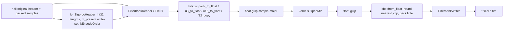
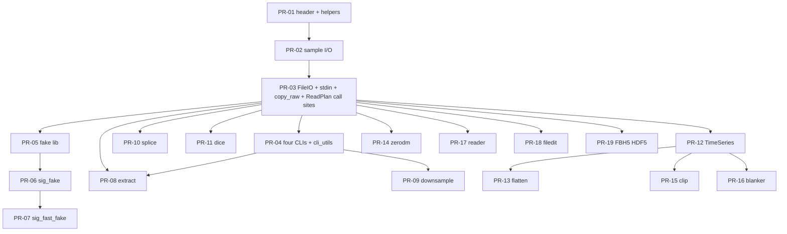

# SIGPROC C++23 Rewrite — Master Implementation Plan

| Field | Value |
|---|---|
| **Title** | Porting necessary SIGPROC filterbank tools into `sigproc2` |
| **Author** | TBD (maintainer / coding agents) |
| **Date** | 2026-09-11 |
| **Status** | Draft (rev 6) — user decisions incorporated |
| **Target repo** | `/Users/pravirk/projects/sigproc2` |
| **Behaviour source** | [FRBs/sigproc](https://github.com/FRBs/sigproc) @ `8f3a9a6632f15a146dd9e058a9a1ec807d1f992d` (2021-07-16) |
| **Not format truth** | Local `/Users/pravirk/projects/sigproc` (mixed C++11 rewrite + incomplete C tree) |
| **Design inspiration** | [FRBs/sigpyproc3](https://github.com/FRBs/sigpyproc3) (shape only; do not copy Python APIs) |
| **Constraint file** | [`Agents.md`](Agents.md) / [`AGENTS.md`](AGENTS.md) — highest priority after executable behaviour |
| **On-disk location (resolved)** | `docs/implementation-plan.md` |
| **Companion (not staffable)** | `docs/future-plan.md` — Phase 5–8 search stack |
| **Staffing scope of this RFC** | Phase 0–4 filterbank manipulation **plus** extra FBH5 I/O (PR-19). Dedisperse / fold / seek / RFI / tree = `docs/future-plan.md` (K21). |

This document is the **orchestration spec** for coding agents implementing Phase 0–4 and PR-19 (FBH5). A subagent taking one of those PRs must not invent architecture, style, dependencies, or product policy. Follow `Agents.md`, then this plan, then the **pinned FRBs/sigproc sources** (raw links below). Do **not** treat local `/Users/pravirk/projects/sigproc` C++ files as original behaviour. **Resolved decisions below are final.** Do not implement anything in `docs/future-plan.md` from this staffing wave.

---

## How coding agents must use this document

1. Implement **one PR** at a time, in order, honouring **Dependencies**.
2. **Library-first.** Land library + Catch2 tests before (or in the same PR as) a thin `sig_*` binary.
3. Add a new executable as `applications/sig_<original_name>.cpp` (underscores, `sig_` prefix). `applications/CMakeLists.txt` GLOB-picks it up. Do **not** list sources in CMake.
4. Public headers: `include/sigproc/`, include as `<sigproc/...>`. Private: `lib/sigproc/`, include as `"sigproc/..."`. Apps and tests never include private headers.
5. New public types only when a **CLI in this RFC** needs them. This RFC adds `TimeSeries` with flatten. It does **not** add `FilterbankBlock`, `FourierSeries`, or `FoldedCube`.
6. CLI flags are a **superset of original C SIGPROC**. Original **short flags are visible in `--help`** (not hidden `alias()`). They keep original meaning and units. Long flags are extras.
7. Run `clang-format` before committing. Do not renegotiate style files.
8. Never commit to `main`. No Python, Boost, PGPLOT, historical converters, or PSRFITS.
9. **Resolved decisions** in this document are final. The only remaining open product question for **search** tools (OQ-5 DM constant) lives in `docs/future-plan.md`.
10. Do **not** implement Phase 5–8 from this document **or** from `docs/future-plan.md` until a follow-up fills numeric oracles. `future-plan.md` is a structured sketch, not a staffing spec.

### Pinned original sources (format and CLI truth)

Commit: [`8f3a9a6632f15a146dd9e058a9a1ec807d1f992d`](https://github.com/FRBs/sigproc/commit/8f3a9a6632f15a146dd9e058a9a1ec807d1f992d)

Raw files (always this SHA):

| Role | URL |
|---|---|
| Header read | https://raw.githubusercontent.com/FRBs/sigproc/8f3a9a6632f15a146dd9e058a9a1ec807d1f992d/src/read_header.c |
| Header write | https://raw.githubusercontent.com/FRBs/sigproc/8f3a9a6632f15a146dd9e058a9a1ec807d1f992d/src/send_stuff.c |
| Filterbank header | https://raw.githubusercontent.com/FRBs/sigproc/8f3a9a6632f15a146dd9e058a9a1ec807d1f992d/src/filterbank_header.c |
| Sample read | https://raw.githubusercontent.com/FRBs/sigproc/8f3a9a6632f15a146dd9e058a9a1ec807d1f992d/src/read_block.c |
| Pack/unpack | https://raw.githubusercontent.com/FRBs/sigproc/8f3a9a6632f15a146dd9e058a9a1ec807d1f992d/src/pack_unpack.c |
| Globals / signed | https://raw.githubusercontent.com/FRBs/sigproc/8f3a9a6632f15a146dd9e058a9a1ec807d1f992d/src/header.h |
| Help text | https://raw.githubusercontent.com/FRBs/sigproc/8f3a9a6632f15a146dd9e058a9a1ec807d1f992d/src/help.c |
| `header` | https://raw.githubusercontent.com/FRBs/sigproc/8f3a9a6632f15a146dd9e058a9a1ec807d1f992d/src/header.c |
| `bandpass` | https://raw.githubusercontent.com/FRBs/sigproc/8f3a9a6632f15a146dd9e058a9a1ec807d1f992d/src/bandpass.c |
| `decimate` | https://raw.githubusercontent.com/FRBs/sigproc/8f3a9a6632f15a146dd9e058a9a1ec807d1f992d/src/decimate.c |
| `chop_fil` | https://raw.githubusercontent.com/FRBs/sigproc/8f3a9a6632f15a146dd9e058a9a1ec807d1f992d/src/chop_fil.c |
| `extract` | https://raw.githubusercontent.com/FRBs/sigproc/8f3a9a6632f15a146dd9e058a9a1ec807d1f992d/src/extract.c |
| `downsample` | https://raw.githubusercontent.com/FRBs/sigproc/8f3a9a6632f15a146dd9e058a9a1ec807d1f992d/src/downsample.c |
| `fake` | https://raw.githubusercontent.com/FRBs/sigproc/8f3a9a6632f15a146dd9e058a9a1ec807d1f992d/src/fake.c |
| `fast_fake` | https://raw.githubusercontent.com/FRBs/sigproc/8f3a9a6632f15a146dd9e058a9a1ec807d1f992d/src/fast_fake.c |
| `splice` | https://raw.githubusercontent.com/FRBs/sigproc/8f3a9a6632f15a146dd9e058a9a1ec807d1f992d/src/splice.c |
| `dice` | https://raw.githubusercontent.com/FRBs/sigproc/8f3a9a6632f15a146dd9e058a9a1ec807d1f992d/src/dice.c |
| `flatten` | https://raw.githubusercontent.com/FRBs/sigproc/8f3a9a6632f15a146dd9e058a9a1ec807d1f992d/src/flatten.c |
| `zerodm` | https://raw.githubusercontent.com/FRBs/sigproc/8f3a9a6632f15a146dd9e058a9a1ec807d1f992d/src/zerodm.c |
| `clip` | https://raw.githubusercontent.com/FRBs/sigproc/8f3a9a6632f15a146dd9e058a9a1ec807d1f992d/src/clip.c |
| `blanker` | https://raw.githubusercontent.com/FRBs/sigproc/8f3a9a6632f15a146dd9e058a9a1ec807d1f992d/src/blanker.c |
| `reader` | https://raw.githubusercontent.com/FRBs/sigproc/8f3a9a6632f15a146dd9e058a9a1ec807d1f992d/src/reader.c |
| `filedit` | https://raw.githubusercontent.com/FRBs/sigproc/8f3a9a6632f15a146dd9e058a9a1ec807d1f992d/src/filedit.c |
| DM delay | https://raw.githubusercontent.com/FRBs/sigproc/8f3a9a6632f15a146dd9e058a9a1ec807d1f992d/src/dmdelay.c |

If a filename is `applications/foo.cpp` in the local mixed tree, **still use the FRBs `src/*.c` URL above**. Local `applications/chop_fil.cpp` / `fileIO.cpp` / `filterbank_header.hpp` are the buggy ancestry of `sigproc2`, not original C.

---

## Overview

`sigproc2` is a **C++23 HPC rewrite** of SIGPROC: `libsigproc` plus `sig_*` CLIs. The product goal of **this RFC** is a **filterbank manipulation toolkit**: create, inspect, cut, stitch, downsample, flatten, zerodm, clip/blank, dump, and edit SIGPROC `.fil` / `.tim` files — matching original C capability or adding to it, with no silent regressions in header keys or the on-disk format.

The current tree has the right skeleton (two-layer API, four CLIs, `SigprocHeader`, reader/writer, `bits`, `kernels`). It is **not** format-correct. Files it writes are not original SIGPROC filterbanks; tests hide this by round-tripping themselves.

**This RFC (Phase 0–4)** repairs the codec and I/O, restores original C flag semantics on the four existing tools, then ports the Agents.md manipulation list (`fake` / `fast_fake`, splice, extract, downsample, flatten, zerodm, clip/blanker, reader, filedit, dice).

**Not in this RFC:** dedisperse, tree, fold, seek, RFI, `FilterbankBlock`, `FourierSeries`, `FoldedCube`. Those remain in-scope for the project (`Agents.md` Next list) but need a second RFC with oracles. Do not staff them from this text.

---

## Background & Motivation

### Current rewrite (`sigproc2`)

| Layer | Path | Status |
|---|---|---|
| Public API | `include/sigproc/{header,io,filterbank,bits,kernels,astro,common/params,common/types}.hpp` | Extend, do not replace |
| Private | `lib/sigproc/{exceptions,parsing,utils}.hpp` | In place; string codec is wrong width |
| Library TUs | `lib/{header,io,filterbank,bits,kernels,astro}.cpp` | Header encode and sample I/O wrong vs original C |
| CLIs | `applications/sig_{header,bandpass,decimate,chopfil}.cpp` | Present; rewrite-shaped flags; several payload bugs |
| Tests | `tests/tests.cpp`, `tests/astro_t.cpp` | Self-round-trip 32-bit files + isolated 4-bit pack |
| Unused deps | HighFive, xsimd, FFTW linked; **no call sites yet** | HighFive used in PR-19 (private); FFTW waits for future-plan seek |

`FileReader` is **declared** in `include/sigproc/io.hpp` and **never defined**. `FilterbankReader` uses `io::FileIO`. This RFC **deletes** the unimplemented `FileReader`/`FileBase` public API rather than completing a second reader (K19).

### Two trees named “sigproc”

| Tree | What it is | Use it for |
|---|---|---|
| [FRBs/sigproc](https://github.com/FRBs/sigproc) @ `8f3a9a6` | Original C/Fortran toolkit | On-disk format, numerics, CLI flags |
| `/Users/pravirk/projects/sigproc` | Mixed CMake C++11 rewrite + `Makefile.am` that still *names* C files that are **not on disk** | Ancestry of `sigproc2` bugs (`FileIO::read_data` reinterpret-cast; `applications/chop_fil.cpp` writes zeros). **Not** format truth. |

`Makefile.am` in the local tree lists `read_header.c`, `send_stuff.c`, etc. Those files are **absent** locally. Agents that `open()` `/Users/pravirk/projects/sigproc/src/read_header.c` will fail. Use the raw GitHub URLs.

### Original C format (summary)

From `send_stuff.c` / `read_header.c` / `read_block.c` / `pack_unpack.c` / `header.h`:

- String: `int32` length + bytes. `get_string`: if `nchar>80 || nchar<1`, treat as error (empty strings are **unreadable**).
- Integers including `barycentric` / `pulsarcentric`: `sizeof(int)` = 4.
- `signed`: `send_char` / `sizeof(char)` = 1. `OSIGN` is `1`. `header.c`: `isign > 0` prints **UNSIGNED**; `isign < 0` prints **SIGNED**.
- Markers: `HEADER_START`, `HEADER_END`, `FREQUENCY_START`, `FREQUENCY_END`.
- Sparse write: only keys the writer emits (`filterbank_header.c`, `fake.c`, …).
- 1/2/4-bit: **low bits first**. `charof2ints(i,j)` → `(j<<4)+i` so `{1,2}` packs to `0x21`.
- 8-bit `read_block`: **always** `unsigned char` → `float`. `isign` is not used for conversion.
- DM delay (`dmdelay.c`): `4148.741601 * (1/f1² − 1/f2²) * dm`. Rewrite `kDispConst` is L&K `4.1488080e3`. **`fake.c` additionally uses `8.3e3` for intra-channel smear.** Mapping for this RFC is K28 (do not collapse these three numbers).

### Pain points (verified in `sigproc2`)

- `lib/sigproc/utils.hpp`: `write_string` uses `sizeof(SizeType)` (8 on LP64); `read_string` uses `sizeof(std::streamsize)` (8). Same width on LP64 but **not** original `int32`, and the two types are not guaranteed identical.
- `barycentric` written as `sizeof(bool)`.
- `fromstream` **warns** on unknown keys and does **not** skip the value; the next `read_string` desynchronises. (`FREQUENCY_START` is currently unknown, so table files cannot be parsed.)
- `FileIO::read_data` unpacks 1/2/4-bit then `reinterpret_cast<float*>`; 8/16-bit never converted. Only `nbits==32` works.
- Default bit-order `"big"` in `lib/io.cpp` and `lib/filterbank.cpp`.
- `sig_chopfil` writes zeroed `out_arr`, ignores `block` (copied from local C++ `chop_fil.cpp`, not original `chop_fil.c`).
- `sig_decimate` `hdr.update` then uses mutated `nchans` for stride, `nsamps = block_len / nchans`, and `kernels::downsample`.
- `unpack_in_place` loops `ii != 0` (skips index 0). 1-bit in-place endianness is inverted vs out-of-place `unpack_1bit`.
- `get_dm_delays(..., "top")` throws (only `"ch1"` / `"center"`). Deferred to the later RFC.
- `params.hpp` `tsamp` helpstr says `(us)` while stored values are seconds. Original `header -tsamp` **prints** microseconds (`tsamp*1e6`).
- `sig_header` prints `bool signed ? SIGNED : UNSIGNED`, inverted vs original `isign>0` → UNSIGNED.

---

## Goals & Non-Goals

### Goals (this RFC)

- Original-compatible `.fil` / `.tim` header + payload I/O.
- Filterbank CLI toolkit: fake, fast_fake, header, bandpass, decimate, chop_fil, extract, downsample, splice, dice, flatten, zerodm, clip, blanker, reader, filedit.
- Original C flags keep original meaning **and appear in `--help`**; extras are a superset.
- Extra **FBH5 / HDF5** I/O (Breakthrough Listen-style), dispatched from `FilterbankReader`/`Writer`. Primary product remains `.fil`.
- Library APIs in C++23; kernels HPC (OpenMP, raw loops).

### Non-goals (this RFC and this repo iteration)

- Staffing dedisperse / tree / fold / seek / RFI / filmerge / TEMPO from this text (`docs/future-plan.md`).
- `FilterbankBlock`, `FourierSeries`, `FoldedCube`.
- Python bindings; Boost; TBB; `std::execution`.
- Historical converters (`filterbank` as WAPP/PSPM/… ingest, `wapp2fb`, …).
- PGPLOT UIs.
- PSRFITS.
- HighFive / HDF5 includes in **public** headers (private backend only).
- Replacing CMake GLOB; new public layout.
- Line-by-line Fortran `seek`.
- Dual 8-byte-length header reader for files this rewrite already wrote.
- HDF5 stdin/stdout (`"-"` must throw).

---

## Key Decisions

| # | Decision | Rationale |
|---|---|---|
| K1 | C++23 library + `sig_*` CLIs only. No Python. | `Agents.md` |
| K2 | Behaviour source is **FRBs/sigproc @ `8f3a9a6`**. Local `/Users/pravirk/projects/sigproc` is ancestry, not format truth. | Cited C files are not in the local tree |
| K3 | Do not invent a new architecture. Extend `include/sigproc/`. Sigpyproc3 inspires shape only. On-disk layout is **sample-major** `[t][if][chan]`. | `Agents.md` |
| K4 | Two-layer C++. Public: `span`, concepts, `std::format`, RAII, exceptions. Kernels: raw loops, OpenMP, LUTs. No owning `new`/`delete`. | `Agents.md` |
| K5 | OpenMP only. xsimd only after a measured hot path. Never in public headers. **Keep `-ffast-math` in Release.** | `Agents.md`; not an Open Question |
| K6 | Binary names `sig_<original_name>` with underscores. **`sig_fast_fake` is a required install name.** | `Agents.md` mapping table |
| K7 | CLI11 **superset of original C**. Original short flags keep original units/semantics and are **visible in `--help`** (not hidden `alias()`). The four existing apps are rewrite-shaped; PR-04 repairs them against original C help text. Long-flag extras allowed. | User decision OQ-3 |
| K8 | Library-first, then CLI. | `Agents.md` |
| K9 | In-memory `HeaderValue` stays `variant<int,double,bool,string>`. On-disk: strings `int32` length; ints `int32`; `barycentric`/`pulsarcentric` `int32` 0/1; `signed` `int8`. | Original C widths |
| K10 | Default 1/2/4-bit order is **little** (low bits first). Keep big-endian kernels; I/O selects little. Do not copy sigpyproc3’s mixed default. | `pack_unpack.c` / `read_block.c` |
| K11 | Processing gulp is `float32` sample-major. Pack/unpack at the I/O boundary. 8-bit conversion is **unsigned** (`uint8_t`→`float`), matching `read_block.c`. `signed` is a header flag only in this RFC. | Original `read_block`; see K22 |
| K12 | **FBH5 I/O is in this RFC (PR-19)** as extra, not a `.fil` replacement. HighFive is private (`lib/io_hdf5.cpp`, `"sigproc/io_hdf5.hpp"`). **Never** include HighFive/HDF5 in public headers. FFTW unused until the later seek RFC; stay linked. | User decision OQ-6 |
| K13 | Existing four CLIs are “done” in Agents.md only after Phase 0 repairs. | Format bugs |
| K14 | This RFC adds `TimeSeries` with flatten (first `data_type=2` writer). **No `FilterbankBlock`.** | `Agents.md` anti-speculation |
| K15 | Apps may share `applications/cli_utils.hpp` (not installed). | Keep public API small |
| K16 | Catch2 synthetic builders **plus** vendored `tests/data/tiny.fil` (original-format, few KB, synthetic, with README recipe). Golden byte strings for header encode. | User decision OQ-7 |
| K17 | Branch + PR; never `main`. Rollback = revert. No feature flags. | `Agents.md` |
| K18 | Packed integers and headers: bit-identical to **this encoder** (documented order). Float kernels: Debug oracle + tolerance in Release. | `-ffast-math` |
| K19 | **One public sample I/O type: `FileIO`.** Delete unimplemented `FileReader` / `FileBase` from `io.hpp` in PR-03. `FilterbankReader` owns `FileIO`. Multi-file tools open N readers. Reader filename `""`/`"-"` is **stdin**. Writer filename `""`/`"-"` is **stdout** (K30). | Dual readers are not independently implementable |
| K20 | Sparse header write uses an explicit **write-set** (`m_present`), not “omit zeros”. Never emit empty strings. Encode in a **fixed key order** (`kEncodeOrder`), not `unordered_map` iteration. | Constructor default-fills every key; original `get_string` rejects `nchar<1` |
| K21 | Dedisperse / fold / seek / RFI / tree / filmerge / TEMPO are **out of this RFC**. Companion: **`docs/future-plan.md`** (not staffable). Inventory stays. | User decision OQ-8 |
| K22 | In-memory `bool signed`: **`true` means signed samples (`isign < 0`)**. On-disk `int8`: `+1` unsigned (original `OSIGN`), `-1` signed. `sig_header` prints UNSIGNED when `!signed` (i.e. `isign>0`). Default unsigned. Do not convert 8-bit as `int8_t` in this RFC. | Original `header.c` polarity |
| K23 | `sig_chopfil` **matches original `chop_fil.c`**: `-s/-r`, default read **1 s**, stdout, **byte-copy header and payload**, does **not** rewrite `tstart`/`nsamples`. `sig_extract` is the tstart-updating slicer. | Product choice; not a “bugfix” vs extract |
| K24 | `sig_fast_fake` is a trampoline executable (same library as `sig_fake --fast`) so the `sig_<original>` name exists on PATH. | K6 + shared implementation |
| K25 | Header golden tests pin **`kEncodeOrder`**, not original `fake.c` key sequence. Do not claim bit-identity with `fake` output unless a test uses a fake-specific writer helper that emits fake’s sequence. | Stable tests vs hash-order maps |
| K26 | **Stdin is a library concern, including `fromstream` (PR-01).** `fromstream` returns `bool`. Seekable failed magic: `seekg(0)`, return `false`. Non-seekable failed magic: throw (cannot rewind). Non-seekable success: no `seekg(end)`; `nsamples` 0 unless present; tee `m_raw_header`. `std::stringstream` is seekable. `FileIO` / `FilterbankReader` accept `"-"` / empty as stdin. Skip-forward by read-and-discard; backward seek throws. | Original CLIs default stdin; `fromstream` today seeks |
| K27 | **Raw copy primitive** on `FilterbankReader`: `write_raw_header` + `copy_samples`. `sig_chopfil` uses only this (no `FilterbankWriter` re-encode). `sig_extract` re-encodes the header, then `copy_samples` for the payload. | Chop byte-identity vs `kEncodeOrder` |
| K28 | **Fake pulse physics match `fake.c`, not `kDispConst`.** Intra-channel smear uses `8.3e3`; inter-channel `shift[c]` uses `dmdelay` constant `4148.741601`. `kDispConst` / `kDispConstLK` (`4.1488080e3`) stay the library default for **new** APIs (later dedisp RFC). Do not mix the three numbers. | Pinned `src/fake.c` uses two constants; L&K is a different formula |
| K29 | PR-03 **mechanically updates** the three existing `ReadPlanTuple` call sites (`sig_bandpass`, `sig_decimate`, `sig_chopfil`) so the tree still links. Honour `until_eof` / short reads in those loops. No original-C flag restoration in PR-03. | Independently mergeable Phase 0 |
| K30 | **Stdout is a library concern (PR-03).** `FilterbankWriter(std::ostream&)` and filename `""`/`"-"` → stdout (binary). `TimeSeries::tostream` in PR-12. CLI `add_output_file`: omitted / `-o -` → stdout. Decimate/splice/dice/flatten/extract/zerodm/clip use this; they must not `open("")`. **HDF5 forbids `"-"`.** | Original writers default stdout |
| K31 | **Two repo docs:** `docs/implementation-plan.md` (this RFC, staffable); `docs/future-plan.md` (search stack, not staffable). | User decision OQ-1 / OQ-8 |
| K32 | **Vendor fixture** `tests/data/tiny.fil` + `tests/data/README.md`: 8 chans × 16 samples × 8-bit, original `int32` string lengths, synthetic, regenerable. Used from PR-01 `fromfile` smoke. Never check in an 8-byte-length file. | User decision OQ-7 |
| K33 | **`sig_filedit --dry-run` / `-n`:** print old vs new header keys, exit 0, do not write. In-place remains default. `-o` extra still copies. Refuse header-length change. | User decision OQ-9 |
| K34 | **`sig_zerodm` is deterministic:** round mean, subtract, add 64, clamp `[0,255]`. No `mjk_rand` dither. Do **not** claim bit-identity with original payload. | User decision OQ-17 |
| K35 | **FBH5 dispatch:** `.h5` / `.hdf5` / `.fbh5` extension **or** HDF5 magic. Dataset `data` shape `(nsamples, nifs, nchans)`; file attrs `CLASS=FILTERBANK`, `VERSION=2.0`; SIGPROC keys as dataset attrs. nbits≥8 native dtype; 1/2/4-bit packed uint8 + `nbits` attr. Chunk along time. | User decision OQ-6 |

---

## Current vs planned library map

### Current

```
include/sigproc/
  astro.hpp bits.hpp filterbank.hpp header.hpp io.hpp kernels.hpp
  common/{params,types}.hpp
lib/  astro.cpp bits.cpp filterbank.cpp header.cpp io.cpp kernels.cpp
lib/sigproc/  exceptions.hpp parsing.hpp utils.hpp
applications/  sig_{header,bandpass,decimate,chopfil}.cpp
tests/  tests.cpp astro_t.cpp
```

### Planned in this RFC

```
include/sigproc/
  fake.hpp          # PR-05  kFakeSmearConst=8.3e3, kFakeDelayConst=4148.741601
  timeseries.hpp    # PR-12
  # bits.hpp gains unpack_to_float / u8_to_float / u16_to_float / f32_copy / from_float
  # io.hpp loses FileReader/FileBase; FileIO seek is int64_t
  # reader "-" = stdin; FilterbankWriter "-" = stdout; fromstream tees m_raw_header
  # header.hpp gains write-set + get_freq_table; get_freqs uses the table
  # common/params.hpp gains kEncodeOrder

lib/sigproc/header_codec.hpp   # private int32 string I/O, on-disk type map
lib/sigproc/io_hdf5.hpp        # PR-19 private HighFive wrapper (quoted include)
lib/io_hdf5.cpp

applications/cli_utils.hpp     # lands in PR-04 with the four CLI repairs
applications/sig_{fake,fast_fake,extract,downsample,splice,dice,
                  flatten,zerodm,clip,blanker,reader,filedit}.cpp

tests/fil_test_utils.hpp       # in-memory builders
tests/data/tiny.fil            # PR-01 vendor fixture (original int32 lengths)
tests/data/README.md           # regeneration recipe
tests/header_format_t.cpp io_nbits_t.cpp bits_t.cpp fake_t.cpp hdf5_t.cpp
```

**Not in this RFC:** `block.hpp`, `dedisp.hpp`, `folded.hpp`, `fourierseries.hpp`, `rfi.hpp`. HighFive stays out of `include/sigproc/`.

Public namespaces stay: `sigproc::io::SigprocHeader`, `sigproc::io::FileIO`, `sigproc::FilterbankReader` / `Writer`, `sigproc::bits`, `kernels`, `astro`, `params`.

---

## Data-flow / architecture



Gulp pipeline: `get_readplan` → `seek_sample` → unpack/convert → kernel → quantize/pack → write. Dedispersion (later RFC) is the same gulp + skipback + delay table, **without** a `FilterbankBlock` type.

`kernels::add_channels` today uses parameter `nchans` as **both** the input stride (`inbuffer[nchans*ii + jj]`) and the add-width (`jj` from `chan_start` to `chan_start+nchans`). Callers that add a subset of a wider spectrum must not reuse this overload as-is. A later RFC should split `nchans_in` vs `nadd`. Do not “fix” the signature in Phase 0 unless a Phase 0 caller needs it (none do).

---

## On-disk format

### String codec (PR-01)

- Prefix: `std::int32_t` length, little-endian on our CI (native `int` as original `fwrite`; all supported hosts are LE).
- Payload: raw bytes, **1..80** inclusive on write. Empty strings are **never** written (original `get_string` returns `"ERROR"` if `nchar<1`).
- On read: if length not in `1..80`, fail the header (do not allocate 4096). Cap matches original.

`write_string` and `read_string` must use the **same** `std::int32_t` type (today they disagree: `SizeType` vs `streamsize`).

### Header grammar

```
int32 len | "HEADER_START"
repeat until HEADER_END:
  int32 len | key
  if key in {HEADER_END}: stop
  if key in {FREQUENCY_START, FREQUENCY_END}: no payload (markers)
  if key is string-valued: int32 len | bytes   # never empty
  if key is signed: int8
  if key is barycentric or pulsarcentric: int32
  if key is other int: int32
  if key is double or fchannel: float64
```

`FREQUENCY_START` is a **marker with no payload**. Then ordinary keys continue, including a normal `nchans` key, then one or more `fchannel`+`float64`, then `FREQUENCY_END`. `nchans` is **not** a special payload of `FREQUENCY_START` (`read_header.c` still handles `nchans` via its own branch while `expecting_frequency_table=1`). Original `frequency_table[4096]` caps table channels; this rewrite may store a `vector` (superset) but should warn above 4096.

Unknown keys: original C **exits**. This rewrite:

1. `spdlog::warn` the token.
2. **Buffer** the next 8 bytes in memory (do **not** `seekg` restore — that fails on pipes).
3. For candidate sizes `{4, 8, 1}`: interpret that many buffered bytes as the value; parse the remainder as a length-prefixed string; **accept** iff that string is a key in `kSigprocKeys` **or** `HEADER_END` **or** `FREQUENCY_START` **or** `FREQUENCY_END` **or** `fchannel`. Consume the accepted prefix from the buffer; leftover bytes are the start of the next token (or read more). Else try the next size.
4. If none succeed, **fail** the header (`std::runtime_error`). Do not continue desynchronised.

**Current code does not do this.** `fromstream` warns and leaves the value unread, then `seekg(0, end)` for sizes. Tests in PR-01 must cover: `FOO` + `int32` + `HEADER_END` warns and parses; `FREQUENCY_START` is **not** handled by the unknown path; a **seekable `stringstream` of header-only bytes** succeeds (`raw_header()` matches; `nsamples` may be computed as 0 because `data_size=0`). **`std::stringstream` is seekable** (`tellg` succeeds) — do not treat it as a pipe. Non-seekable behaviour is tested with a `tellg()==-1` / non-seekable `streambuf` shim (PR-01 tests a–c).

### Write-set (`m_present`) — implementable sparse encode

`SigprocHeader()` still default-fills `m_data` for `get()` convenience. Defaults are **not** written.

Private:

```cpp
std::unordered_map<std::string, HeaderValue> m_data;
std::vector<std::string> m_file_order;   // keys as last fromstream saw them
std::set<std::string> m_present;         // keys allowed on write
std::vector<double> m_freq_table;        // fchannel values; empty if unused
std::vector<std::byte> m_raw_header;     // exact bytes consumed by last fromstream
```

Rules:

1. Constructor: fill `m_data` defaults; `m_present` **empty**; `m_file_order` empty.
2. `set` / `update` (user): update `m_data`; insert key into `m_present`. If the value is an empty string, **erase** from `m_present` (never emit).
3. `fromstream` (PR-01 owns this; K26):
   - Tee every byte read into `m_raw_header`.
   - First token not `HEADER_START`: if the stream is seekable, `seekg(0)` and **`fromstream` returns `false`** (original `read_header` rewind + return 0). If **not** seekable, **throw** (cannot rewind). `std::stringstream` is seekable — failed magic on a stringstream is the `false` path, not throw.
   - Loop until `HEADER_END`. `header_size = m_raw_header.size()`.
   - **Seekable:** `seekg(0, end)` for `file_size`; `data_size = file_size - header_size`; if `nsamples` was not in `m_present`, compute it from `data_size`; then `seekg(header_size)` so the payload is next.
   - **Non-seekable:** do **not** seek to end or rewind. Leave `nsamples` **0** unless the key was present (original `header.c` on stdin). Leave `data_size`/`file_size` 0. Stream position is already at the first payload byte.
   - For each key successfully read, `set` into `m_data`, insert `m_present`, append `m_file_order`. Markers not stored as values. `fchannel` values go to `m_freq_table`. In-memory `fch1`/`foff` may be set to 0 for derived accessors (original); they are **not** written if the table is used (rule 8).
   - Expose `[[nodiscard]] std::span<const std::byte> raw_header() const noexcept`.
4. Encode list:
   - If `m_file_order` nonempty (read a file): those keys still in `m_present`, in file order; then any other `m_present` keys in `kEncodeOrder`.
   - Else (new header): `m_present` ∪ **required core**, minus empty strings, in `kEncodeOrder`.
5. Required core for **new** headers: `machine_id`, `telescope_id`, `data_type`, `nchans`, `nbits`, `nifs`, `tstart`, `tsamp`, and either (`fch1` and `foff`) **or** a nonempty `m_freq_table` (rule 8), never both. `source_name` only if nonempty. `nbeams`/`ibeam` only if `m_present`. `signed` only if `m_present` (original `fast_fake` writes it for 8-bit).
6. Never write `kExtraKeys` (`telescope`, `tobs`, `header_size`, …). Those stay derived-only. `header_size` / `data_size` / `file_size` remain extra `int` values computed after read; PR-03 uses 64-bit **locals** for file math; do not widen `HeaderValue` in this RFC (OQ-10).
7. Do **not** copy original `send_coords` (`(raj != 0.0) || (raj != -1.0)` is always true). Write `src_raj`/`src_dej`/`az_start`/`za_start` only if in `m_present`.
8. **Frequency table vs `fch1`/`foff` (exclusive).** If `m_freq_table` is nonempty, the encoder emits `FREQUENCY_START`, then **`nchans` once**, then `fchannel`+`float64` × N, then `FREQUENCY_END`, and **erases `fch1`, `foff`, and `nchans` from the ordinary encode list** so `nchans` is not written twice. If the table is empty, emit `fch1`/`foff`/`nchans` as ordinary keys and do not emit the markers. `splice` always takes the table path (original `splice.c` writes the table immediately after `data_type`, with no `fch1`/`foff`). The table path **owns `nchans`**.

### Encode order

`params::kSigprocKeys` stays a lookup map. Add:

```cpp
inline constexpr std::array<std::string_view, /*N*/> kEncodeOrder = {
  "rawdatafile", "source_name", "machine_id", "telescope_id", "data_type",
  "barycentric", "pulsarcentric",
  "az_start", "za_start", "src_raj", "src_dej",
  "tstart", "tsamp", "nbits", "nsamples",
  "fch1", "foff", "nchans", "nifs",
  "refdm", "period", "signed", "ibeam", "nbeams",
  "npuls", "nbins",
};
```

Markers and `fchannel` are emitted only by rule 8, not by iterating this array. When the table path is active, skip `fch1`, `foff`, **and `nchans`** even if they appear here. Golden tests `REQUIRE` this sequence for a new header with a known `m_present` and **empty** table.

### Sample payload

| `nbits` | Conversion to float | Conversion from float (this RFC) |
|---|---|---|
| 1, 2, 4 | unpack little, then `uint8`→`float` | round-nearest, clip `[0, 2^nbits-1]`, pack little |
| 8 | `uint8_t`→`float` **always** | round-nearest, clip `[0,255]`, write `uint8` |
| 16 | `uint16_t`→`float` | round-nearest, clip `[0,65535]` |
| 32 | memcpy `float` | memcpy `float` |

`nsamples` from file size: **only on seekable streams**, `nsamples = (data_size * 8) / (nchans * nifs * nbits)` with 64-bit intermediates when the header omits the key. On stdin / non-seekable streams, do **not** require `nsamples` for gulp loops (K26, `get_readplan` `until_eof`).

---

## Original C CLI contracts (the four existing tools)

These tables are the **superset baseline** for PR-04. Rewrite-only flags stay as extras. Do not map original flags onto different meanings.

### `header` — [src/header.c](https://raw.githubusercontent.com/FRBs/sigproc/8f3a9a6632f15a146dd9e058a9a1ec807d1f992d/src/header.c)

| Original | Meaning | `sig_header` |
|---|---|---|
| optional file; default **stdin** | | positional file **or** stdin |
| no flags | full human dump | same |
| `-telescope` `-machine` `-source_name` `-scan_number` `-datatype` `-frame` `-data_type` `-headersize` `-datasize` `-nsamples` `-tobs` `-az_start` `-za_start` `-fch1` `-bandwidth` `-fmid` `-foff` `-refdm`/`-dm` `-nchans` `-tstart` `-frequencies` `-mjd` `-date` `-utstart` `-nbits` `-ibeam` `-nbeam` `-nifs` `-src_raj` `-src_dej` `-ra_deg` `-dec_deg` `-barycentric` `-pulsarcentric` | print **that** field and exit | **same flag names**, same print units. `-scan_number` prints `0` if the key is absent (original global default). |
| `-tsamp` | print `tsamp*1e6` with `%.5f` (**microseconds**) | **same** |
| (none) | | extra `-k,--key` prints **native stored** units (`tsamp` in seconds). Do not alias `-tsamp` to `-k tsamp`. |
| `isign>0` UNSIGNED / `<0` SIGNED | | print UNSIGNED when `!hdr.get<bool>("signed")` |
| `-obsdb` | MM-survey one-liner | optional extra; skip unless cheap |

### `bandpass` — [src/bandpass.c](https://raw.githubusercontent.com/FRBs/sigproc/8f3a9a6632f15a146dd9e058a9a1ec807d1f992d/src/bandpass.c)

| Original | Meaning | `sig_bandpass` |
|---|---|---|
| stdin default | | stdin or file |
| stdout | `#START` / freq / mean / `#STOP` per dump if `-d`/`-t`; else one average, **no** `#START` | stdout default |
| `-d ndumps` | average this many **spectra** then emit a dump (repeat) | **same** (`-d,--dumps`) |
| `-t secs` | `ndumps = rint(secs/tsamp)` | **same** (`-t,--seconds-per-dump`) |
| `-cube` | extra elapsed-time column; stop after `nchans` dumps | optional later; may omit in PR-04 |
| (none) | | extras: `-s/--start` skip seconds; `-o` file; `-g/--gulp` |

Do **not** treat `-d` as start time or `-t` as total observation. Current rewrite flags are extras, not replacements.

### `chop_fil` — [src/chop_fil.c](https://raw.githubusercontent.com/FRBs/sigproc/8f3a9a6632f15a146dd9e058a9a1ec807d1f992d/src/chop_fil.c)

| Original | Meaning | `sig_chopfil` (K23) |
|---|---|---|
| `-s st` | skip `st` seconds | `-s,--skip` |
| `-r re` | read `re` seconds; **default 1** | `-r,--read` default **1** |
| `-f` | past EOF read `/dev/urandom` | `--force-urandom` (keep; document) |
| stdout | | stdout; `-o` extra |
| byte-copy **existing header** | `tstart`/`nsamples` **unchanged** | same |
| byte-copy packed samples | no unpack | same |
| stdin default | | stdin or file |

Extras allowed: `-g/--gulp`, `-t/--total` as **alias of `-r`** (same meaning: duration to read, default 1 s — not “all”). Updating `tstart` is **`sig_extract`**, not chop.

### `decimate` — [src/decimate.c](https://raw.githubusercontent.com/FRBs/sigproc/8f3a9a6632f15a146dd9e058a9a1ec807d1f992d/src/decimate.c)

| Original | Meaning | `sig_decimate` |
|---|---|---|
| stdin / stdout | | same; `-o` extra |
| `-c naddc` | channels to add; **omitted or `<1` → all `nchans`** | same (do **not** default to 1) |
| `-t naddt` | time samples to add; `<=1` → 1 | same |
| `-T nsamp` | set `naddt` from `nsamples/nsamp` (even) | `-T,--out-nsamp` |
| `-n obits` | output bits; `0` → input nbits | `-n,--nbits` |
| `-headerless` | skip output header | `--headerless` |
| `-o file` | | `-o` |

Implementation: snapshot `in_nchans`, `in_nifs`, `in_nbits` **before** any `hdr.update`. Use snapshots for `stride_len`, `nsamps = block_len / (in_nchans*in_nifs)`, and `kernels::downsample(..., in_nchans, nsamps)`.

---

## Legacy tool inventory

Class: **in-this-RFC** / **later-RFC** / **out**.

| Original | Purpose | Class | `sig_*` | PR |
|---|---|---|---|---|
| `header` | Print / query header | in-this-RFC | `sig_header` | PR-04 |
| `bandpass` | Mean spectrum | in-this-RFC | `sig_bandpass` | PR-04 |
| `decimate` | Time and/or freq add | in-this-RFC | `sig_decimate` | PR-04 |
| `chop_fil` | Time slice, byte-copy | in-this-RFC | `sig_chopfil` | PR-04 |
| `fake` | Synthetic pulsar `.fil` | in-this-RFC | `sig_fake` | PR-05/06 |
| `fast_fake` | Fast Gaussian `.fil` | in-this-RFC | `sig_fast_fake` | PR-07 |
| `extract` | 1-based sample slice, updates tstart | in-this-RFC | `sig_extract` | PR-08 |
| `downsample` | Time-only → 32-bit | in-this-RFC | `sig_downsample` | PR-09 |
| `splice` | Concat channels, same tstart | in-this-RFC | `sig_splice` | PR-10 |
| `dice` | Keep/zap channels (1/8/16-bit in original; 1-bit write exists) | in-this-RFC | `sig_dice` | PR-11 |
| `flatten` | Gulp-median flatten → `data_type=2` | in-this-RFC | `sig_flatten` | PR-12/13 |
| `zerodm` | 8-bit per-spectrum mean subtract | in-this-RFC | `sig_zerodm` | PR-14 |
| `clip` | Time-series outlier clip | in-this-RFC | `sig_clip` | PR-15 |
| `blanker` | Blank pulse phases in `.tim` | in-this-RFC | `sig_blanker` | PR-16 |
| `reader` | ASCII dump | in-this-RFC | `sig_reader` | PR-17 |
| `readchunk` | reader + time window | in-this-RFC (flags on reader) | `sig_reader` | PR-17 |
| `filedit` | In-place header + zap | in-this-RFC | `sig_filedit` | PR-18 |
| `dedisperse` | DM / subbands | **later-RFC** | `sig_dedisperse` | — |
| `tree` | Taylor tree | **later-RFC** (extra vs Agents.md Next) | `sig_tree` | — |
| `dedisperse_all`, `shredder` | Many-DM | later-RFC | — | — |
| `fold` | Fold profiles | later-RFC | `sig_fold` | — |
| `seek` | Periodicity / single-pulse | later-RFC | `sig_seek` | — |
| `ffa` | Fast folding | later-RFC | — | — |
| `rfi_analyse` | RFI (PGPLOT UI **out**) | later-RFC algorithm only | `sig_rfi` | — |
| `filmerge` | Time or freq merge | later-RFC | `sig_filmerge` | — |
| `barycentre`, `depolyco` | TEMPO | later-RFC | — | — |
| `inject_pulsar` | Tempo2 | later-RFC | — | — |
| `profile`, `flux`, `snrdm` | ASCII profile extras | later-RFC | — | — |
| `splitter` | Byte-split stdin | later-RFC | — | — |
| `filterbank`, `wapp2fb`, `bpp2fb`, `scamp2fb`, `pspm2fb`, `gmrt2fb`, `ooty2fb`, `newgmrt2fb`, `psrfits2fb`, `pulsar2k2fb` | Converters | **out** | — | — |
| PGPLOT UIs (`giant`, `peak`, `best`, …) | Plots | **out** | — | — |
| `fddtw` (`EXTRA_PROGRAMS`) | Experimental | **out** | — | — |
| `polyco2period`, `makePsrXml`, `chaninfo`, `step`, `postproc`, `grey` | Aux | **out** | — | — |
| csh wrappers (`quicklook`, `hunt`, …) | Scripts | **out** | — | — |

Agents.md Next list already includes extract and downsample; they are not “extras”. Actual extras vs that list: `tree`, `readchunk` (folded into reader).

---

## Gaps vs original (this RFC)

| Gap | Evidence | Repair |
|---|---|---|
| Header length 8 bytes; `SizeType` vs `streamsize` mismatch | `lib/sigproc/utils.hpp` | PR-01 |
| `barycentric` as `bool` on disk | `params.hpp` `kSBool` | PR-01 |
| Unknown keys not skipped (desync) | `lib/header.cpp` | PR-01 |
| No `FREQUENCY_START` | `kSigprocKeys` | PR-01 |
| Encode order hash-dependent | `unordered_map` iteration in `tobuffer` | PR-01 |
| 8/16-bit reinterpret as float | `FileIO::read_data` | PR-02 |
| Default bitorder `"big"` | `lib/io.cpp` | PR-02 |
| `unpack_in_place` skips 0; 1-bit endian invert | `lib/bits.cpp` | PR-02 |
| Dual writer paths reinterpret floats | `FileIO::write_data` and `FilterbankWriter::write_block` | PR-02 |
| `FileReader` declared only | `io.hpp` | PR-03 delete |
| `seek_bytes(int)` 2 GiB | `io.hpp` | PR-03 `int64_t` |
| `sig_chopfil` writes zeros | `applications/sig_chopfil.cpp` | PR-04 (copy payload; original C semantics) |
| `sig_decimate` uses post-update nchans for stride, nsamps, kernel | `sig_decimate.cpp` | PR-04 snapshot **all three** |
| Four CLIs: rewrite flags, not original C | apps vs `src/{header,bandpass,decimate,chop_fil}.c` | PR-04 |
| `sig_header` signedness polarity | `sig_header.cpp` vs `header.c` | PR-04 |
| `tsamp` helpstr says µs | `params.hpp` | PR-04 help text; `-tsamp` flag still prints µs |

---

## Proposed Design (Phase 0–4 APIs)

### Header

Keep existing `get` / `set` / `try_get` / `update` / `fromstream` / `fromfile` / `tofile`.

```cpp
class SigprocHeader {
  // existing templates …

  /// Channel centres: m_freq_table if nonempty, else fch1+i*foff as double.
  [[nodiscard]] std::vector<double> get_freq_table() const;

  [[nodiscard]] bool has_freq_table() const noexcept;

  /// Existing signature. Encode uses m_present + kEncodeOrder (K20).
  template <BinaryWritableType Stream>
  void tostream(Stream& stream);

  /// Bytes teed by the last successful `fromstream`. Empty if the header
  /// was built in memory. Used by `FilterbankReader::write_raw_header`.
  [[nodiscard]] std::span<const std::byte> raw_header() const noexcept;
};
```

`get_freqs()` (existing `vector<float>`) **must call** `get_freq_table()` and convert, so table files are not ignored. Do not add `tostream(stream, bool sparse)`.

**Seekable helper (PR-01, used by `fromstream`):** try `tellg()`; if it fails or returns `-1`, the stream is not seekable. Do not call `seekg(0, end)` or `seekg(0)` on that stream.

### Bits — one conversion path

```cpp
namespace sigproc::bits {
inline constexpr std::string_view kSigprocBitOrder = "little";

void unpack_to_float(std::span<const std::uint8_t> packed,
                     std::span<float> out,
                     SizeType nbits);          // nbits in {1,2,4}, little

void u8_to_float(std::span<const std::uint8_t> in, std::span<float> out);
void u16_to_float(std::span<const std::uint16_t> in, std::span<float> out);
void f32_copy(std::span<const float> in, std::span<float> out);

/// Round to nearest, clip to BitsInfo range, pack little (or native 8/16/32).
void from_float(std::span<const float> in,
                std::span<std::byte> out,
                const BitsInfo& info);
}
```

`FileIO::read_data` and `FilterbankWriter::write_block` **both** call these. No second reinterpret path.

Quantization (nbits&lt;32): `x' = round(x)` (halfway away from zero is acceptable if tested), then clip `[digi_min, digi_max]`, then pack. Integer ramps `{0,1,2,3}` must round-trip exactly.

Fix `unpack_in_place`: loop `ii = lastsamp; ii-- > 0` including 0, **or stop using in-place in I/O** and only use out-of-place + `unpack_to_float` (preferred). Test index 0 and 1-bit `{1,0,0,0,0,0,0,0}` → packed `0x01`.

### I/O

```cpp
class FileIO {
public:
  /// `filename` empty or "-" → stdin (binary). Otherwise open the path.
  FileIO(const std::string& filename, int nbits);
  /// Non-owning; caller keeps `in` alive. Used by tests.
  FileIO(std::istream& in, int nbits);

  [[nodiscard]] bool seekable() const noexcept;
  /// Convert up to `nread` values. Returns how many floats were stored
  /// (short at EOF). Resizes `block` to that count. Never invents zeros
  /// past EOF.
  SizeType read_data(std::vector<float>& block, int nread);
  void write_data(const std::vector<float>& block, int nwrite);
  /// Absolute or relative seek. Throws if !seekable() unless the
  /// destination is the current position.
  void seek_bytes(std::int64_t nbytes, bool offset = false);
  /// Skip forward: seek if seekable, else read-and-discard.
  void skip_bytes(std::int64_t nbytes);
};

class FilterbankWriter {
public:
  /// `filename` empty or "-" → stdout (binary).
  FilterbankWriter(const std::string& filename, io::SigprocHeader& hdr);
  FilterbankWriter(std::ostream& out, io::SigprocHeader& hdr);
  void write_block(const std::vector<float>& block, int block_len);
};
```

Remove `FileBase` and `FileReader` from `io.hpp`. `FilterbankReader` keeps `io::FileIO` and the same `"-"` / empty filename convention, plus `explicit FilterbankReader(std::istream& in)`.

**Raw header cache (K26 / PR-01).** `fromstream` tees into `SigprocHeader::raw_header()`. `FilterbankReader::write_raw_header` writes that span. Do **not** `rewind()` after parse. Payload reads continue from `HEADER_END`.

```cpp
class FilterbankReader {
public:
  explicit FilterbankReader(const std::string& filename); // "-" / "" = stdin
  explicit FilterbankReader(std::istream& in);

  /// Exact bytes of [HEADER_START … HEADER_END] as read. For chop.
  void write_raw_header(std::ostream& out) const;

  /// Packed payload only. `start_sample` is **0-based**.
  /// `sig_extract` (1-based CLI) calls `copy_samples(start_sample-1, n)`.
  /// No unpack. Seekable: seek. Pipe: skip_bytes then copy.
  void copy_samples(std::ostream& out, SizeType start_sample, SizeType nsamps);

  [[nodiscard]] SizeType nsamps() const; // 0 if unknown (stdin, no key)
  [[nodiscard]] SizeType stride_len() const noexcept; // nchans * nifs
  std::vector<ReadPlan> get_readplan(int gulp, int skipback = 0,
                                     int start = 0, int nsamps = 0);
  /// Returns floats converted this call (0 = EOF).
  SizeType read_plan(SizeType nvalues, std::vector<float>& block,
                     std::int64_t skip_values);
};
```

`ReadPlanTuple` **goes away** in PR-03. Replacement:

```cpp
struct ReadPlan {
  int index;
  SizeType nvalues;  // gulp * stride_len (last physical gulp may be shorter)
  std::int64_t skip_values;
  bool until_eof = false; // true when hdr nsamples==0 (stdin / fake without key)
};
```

so `gulp * nchans * nifs` is not `int`.

**Unknown length (`nsamples==0`):** `get_readplan` must **not** produce an empty plan. Return one entry with `until_eof=true`, `nvalues=gulp*stride_len`, `skip_values=0`. `skipback!=0` on a non-seekable / unknown-length stream throws. The caller repeats `read_plan` until it returns 0 or a short count (`< nvalues`). That is how `fake | bandpass` works (fake does not write `nsamples`).

**Same PR** updates `applications/sig_{bandpass,decimate,chopfil}.cpp` to `plan.nvalues` / `plan.skip_values` **and** `until_eof` loops. `sig_header` does not use `get_readplan`.

**CLI stdin/stdout (PR-04, using PR-03):** positional filename optional; missing or `"-"` → stdin. Apply `CLI::ExistingFile` only when the argument is a nonempty path other than `"-"`. `-o` omitted or `-o -` → stdout via `FilterbankWriter` / `tostream`.

**HDF5 (PR-19, after PR-03):** if the path ends in `.h5`/`.hdf5`/`.fbh5` **or** the file starts with HDF5 magic (`\x89HDF`), `FilterbankReader`/`Writer` dispatch to the private `io_hdf5` backend. `"-"` / empty / `istream` **throw** (`std::invalid_argument`: “HDF5 requires a filesystem path”). No HighFive types in `filterbank.hpp`.

**Chop vs extract:**

| Tool | Header | Payload |
|---|---|---|
| `sig_chopfil` | `write_raw_header` (byte-identical) | `copy_samples` |
| `sig_extract` | `tostream` of a **new** header (not a byte-copy) | `copy_samples` |

### TimeSeries (PR-12)

```cpp
class TimeSeries {
public:
  TimeSeries(io::SigprocHeader hdr, std::vector<float> samples);
  [[nodiscard]] io::SigprocHeader const& hdr() const noexcept;
  [[nodiscard]] std::span<float> samples() noexcept;
  void tostream(std::ostream& out) const;    // data_type=2, nchans=1, nbits=32
  void tofile(std::string_view path) const;  // "" / "-" → tostream(std::cout)
};
```

### Fake (PR-05)

```cpp
namespace sigproc::fake {
struct FakeConfig {
  int nchans = 128, nbits = 4, nifs = 1;
  double tsamp = 80e-6, tobs = 10.0, tstart = 50000.0;
  double fch1 = 433.968, foff = -0.062;  // code default is already negative
  int telescope_id = 4, machine_id = 10;
  std::int64_t seed = -1;
  double period_s = -1, dm = -1, snrpeak = 1.0, duty = 0.04;
  bool smear = true, headerless = false, evenodd = false;
  bool fast = false;
};
struct FastFakeDefaults {  // applied when fast==true / sig_fast_fake
  // nchans=1024, nbits=2, tsamp=64e-6, tobs=270, tstart=56000,
  // fch1=1581.804688, foff=-0.390625, source_name="FAKE"
};
void generate(std::ostream& out, FakeConfig const& cfg);
}
```

**Pulse physics merge bar (PR-05, K28) — write this mapping once:**

| Quantity | Formula (pinned `fake.c`) | Constant |
|---|---|---|
| Intra-channel smear time `tdm` | `8.3e3 * DM * foff / fch1³` then `dc = sqrt(tdm² + tsamp² + w²)` | `kFakeSmearConst = 8.3e3` |
| Inter-channel delay `shift[c]` | `dmdelay(fch1, fch1+c*foff, DM)` | `kFakeDelayConst = 4148.741601` |
| New library APIs (later dedisp) | `kDispConst` | L&K `4.1488080e3` |

Do **not** use `kDispConst` for `shift[]` or smear. Top-hat pulse, Gaussian noise, `evenodd`, headerless. **Binary orbit (`binary_papp`) is out of PR-05.** Fast path: quantized Gaussian only (no DM).

`FakeConfig::foff` default is **already** `-0.062` (matches `fake.c` after its initializer). `fake_help()` prints `def=0.062`. The `if (foff > 0) foff *= -1` path runs only when the **user** passes a positive `-foff`, not on the default. Help: “positive `-foff` is negated.”

### CLI helpers (PR-04, `applications/cli_utils.hpp`)

`init_logging`, `--verbose`/`--debug`, gulp flag, `add_input_file` (optional positional; `"-"` / omitted → stdin; `CLI::ExistingFile` only for real paths), and `add_output_file` (`-o` omitted or `-o -` → stdout). Adopted by the four repaired apps in the **same** PR to avoid a follow-up churn PR.

---

## Alternatives Considered

### A. Line-by-line C/Fortran port — rejected
Violates `Agents.md`.

### B. Copy sigpyproc3 Python APIs / channel-major blocks — rejected
`Agents.md`; layout fight with on-disk sample-major kernels.

### C. Ship new tools on the current codec — rejected
Not interoperable.

### D. Dual 8-byte + 4-byte header reader — rejected
Self-written files are not in the wild; no shim.

### E. Complete `FileReader` vs finish `FileIO` — **choose FileIO (K19)**
Completing `FileReader` requires `protected` stream access, dropping `const`, switching `FilterbankReader` off `FileIO`, and 64-bit seeks on both types. Dual public readers until a later fold-in is exactly the underspecified state. Splice/dice open N `FilterbankReader`s. Revisit a stream type only if a later RFC needs seamless multi-file gulps.

### F. `sig_fast_fake` trampoline vs `--fast` only vs two full apps — **trampoline (K24)**
`--fast` only violates `sig_<original_name>`. Two full apps duplicate CLI. Trampoline honours PATH names and one library.

### G. DM constants — **split (K28), not “L&K everywhere”**
`sig_fake` pulse physics copies `fake.c`: smear `8.3e3`, delays `4148.741601`. The public `kDispConst` remains L&K for new APIs. The later dedisp RFC (OQ-5) picks one constant for `sig_dedisperse`; it is not decided here. Do not document fake smear as L&K.

### H. Splice always `FREQUENCY_START` vs uniform `fch1/foff` — **always table (original)**
Original `splice.c` always writes the table. Matching original is simpler than inferring uniformity.

### I. Filedit — **in-place default + `--dry-run` (K33)**
Original is in-place. Refuse header grow/shrink. `--dry-run`/`-n` prints old vs new keys and writes nothing. `-o` copies first if given.

---

## Security & Privacy

Offline scientific files. No network.

| Threat | Mitigation |
|---|---|
| Truncated / hostile header | String length `1..80`; fail unknown-key probe; `nchans` cap **1e7** in PR-01 (`std::invalid_argument`) |
| Size overflow | 64-bit math in FileIO; `nbits∈{1,2,4,8,16,32}`, `nchans>0`, `nifs>0` |
| `filedit` overwrite | In-place default; `--dry-run` prints diff and writes nothing; `-o` extra |
| `sig_chopfil --force-urandom` | Original `-f`: past EOF, payload is copied from `/dev/urandom` into the output `.fil`. Document on stderr; do not use it as a CSPRNG API |
| Alloc | Gulp-sized; no whole-file except documented |

CI path is `.github/workflows/build.yml` (no leading slash). Jobs today: Release g++-14/clang++-18, Debug, coverage. **ASan/UBSan is a follow-up CI job**, not a Phase 0 PR; header-probe tests still run in Debug.

---

## Observability

spdlog in `.cpp` only. Default warn; `--verbose` info; `--debug` debug. Progress on **stderr** (stdout is often the data). Unknown-key warnings once per key.

---

## Parity / testing strategy

1. **Header bytes** vs `kEncodeOrder` goldens (int32 lengths, `signed` 1 byte, barycentric 4 bytes). Not vs `fake.c` sequence unless using a fake-sequence helper.
2. **Pack/unpack** vs `char2ints` / `char2fourints` / 1-bit `c&1; c>>=1`. `{1,2}` → `0x21`.
3. **Integer payloads** bit-identical (extract, chop byte-copy). Zerodm: deterministic mean, **not** original-dither identity (K34).
4. **Float kernels** vs Debug scalar oracle, `WithinRel(1e-5)`.
5. Optional `SIGPROC_ORIG_BIN` CTest label; **must not fail CI** if original is absent.
6. No PGPLOT.

`tests/fil_test_utils.hpp` lives next to `*_t.cpp`; GLOB already compiles `*_t.cpp`. `#include "fil_test_utils.hpp"` works **without** a new include path. Fixture path: `tests/data/tiny.fil` opened via `std::filesystem::path` relative to the test binary or a compile definition `SIG_TEST_DATA_DIR` if CMake needs it — **do** add `target_compile_definitions(tests PRIVATE SIG_TEST_DATA_DIR=...)` in `tests/CMakeLists.txt` so CI finds the file. Do **not** vendor an 8-byte-length header.

---

## Risks

| Risk | Sev | Mitigation |
|---|---|---|
| Header still not original | Critical | PR-01 goldens + empty-string never written |
| Sample I/O 32-bit only | Critical | PR-02 all nbits |
| Agents copy local C++ rewrite as “original” | High | K2 + raw GitHub URLs |
| Dual FileIO/FileReader | High | Delete FileReader (K19) |
| `unordered_map` encode flake | High | `kEncodeOrder` |
| Original flag semantics overwritten | High | PR-04 tables |
| `-ffast-math` fold/FFT | n/a this RFC | later RFC |
| `int` nsamples 2e9 | High | 64-bit internals; public getter stays `int` (OQ-10) |
| Agents staff seek from this text | High | K21 + `docs/future-plan.md` banner |
| HighFive in public headers | High | PR-19 private TU only |
| Vendored `.fil` with 8-byte lengths | High | PR-01 writes `tiny.fil` with the **new** codec |
| Kernels reimplemented in apps | High | checklist |

---

## Rollout Plan

1. Never commit to `main`.
2. Merge **Phase 0 (PR-01–04)** before staffing tool agents.
3. No feature flags. Rollback = revert.
4. CI: existing workflow. Sanitizer job = follow-up, not a blocker for PR-01 tests.
5. Version stays `0.1.0` until the maintainer bumps.

---

## Resolved decisions (final)

| ID | Answer |
|---|---|
| OQ-1 | Check in as **`docs/implementation-plan.md`**. |
| OQ-2 | **`sig_fast_fake` trampoline** + `sig_fake --fast` (K24). |
| OQ-3 | Original short flags **visible in `--help`**. |
| OQ-4 | Headers/packed ints bit-identical; **float kernels tolerant in Release**. |
| OQ-6 | **FBH5 in this RFC** (PR-19). Private HighFive. `.fil` remains primary. |
| OQ-7 | Vendor **`tests/data/tiny.fil`** + README (synthetic original-format). |
| OQ-8 | Two files: this plan staffable; **`docs/future-plan.md` not staffable**. |
| OQ-9 | Filedit **in-place default** + **`--dry-run`/`-n`** (no write) + extra `-o`. Refuse header-length change. |
| OQ-10 | `nsamples` stays **`int` in `HeaderValue`**. |
| OQ-11 | **No `-swapout`.** Little-endian only. |
| OQ-12 | **No `filmerge` this RFC.** Splice only. |
| OQ-13 | Blanker **constant `-P` only**. No polyco. |
| OQ-14 | **No int8 conversion.** Header flag only. |
| OQ-15 | Extra gulp default **16384**. |
| OQ-16 | extract/downsample in Next; `readchunk` folded into `sig_reader`; `tree` waits. |
| OQ-17 | Zerodm **deterministic round-mean**. No payload bit-identity with original. |

**Still open (not a Phase 0–4 blocker):** OQ-5 DM constant for **`sig_dedisperse`** — (a) L&K (b) `4148.741601` (c) `--dmconst`. Lives in `docs/future-plan.md`. This RFC: fake uses `fake.c` constants (K28); `kDispConst` stays L&K for new APIs.

---

## Companion document

Phase 5–8 (dedisperse, tree, fold, seek, RFI, filmerge, TEMPO, `get_dm_delays("top")`) is sketched in **`docs/future-plan.md`**. Banner there: **DO NOT IMPLEMENT FROM THAT DOCUMENT.** Agents in this wave must not open those PRs.

---

## References

- `Agents.md`
- FRBs/sigproc @ `8f3a9a6632f15a146dd9e058a9a1ec807d1f992d` (raw URLs in “Pinned original sources”)
- Local mixed tree: ancestry only (`include/sigproc/filterbank_header.hpp`, `src/fileIO.cpp`, `applications/chop_fil.cpp`)
- Sigpyproc3 `io/sigproc.py` schema (probe idea; not bit-order defaults)
- `sigproc2` `include/sigproc/*`, `lib/*`, `applications/sig_*.cpp`, `tests/*`, `cmake/sigprocDependencies.cmake`
- Companion: `docs/future-plan.md` (not staffable)
- Breakthrough Listen FBH5 / blimpy `CLASS=FILTERBANK` `VERSION=2.0`
- `docs/sigproc.pdf`
- `.clang-format`, `.clang-tidy`, `.cmake-format.yaml`
- `.github/workflows/build.yml`

---

## PR Plan

Rev 6 incorporates user decisions: two repo docs, FBH5 PR-19, vendor `tiny.fil`, filedit `--dry-run`, visible flags, deterministic zerodm.

---

### PR-01 — Header on-disk format + in-memory test helpers

- **Size:** medium
- **Depends on:** none
- **Library vs CLI:** L
- **Original:** `read_header.c`, `send_stuff.c`, `filterbank_header.c`, `header.h`
- **Files:** `lib/sigproc/utils.hpp`, `lib/header.cpp`, `include/sigproc/header.hpp`, `include/sigproc/common/params.hpp` (`kEncodeOrder`), `tests/fil_test_utils.hpp`, `tests/header_format_t.cpp`, **`tests/tests.cpp` (update if needed; must stay green)**, **`tests/data/tiny.fil`**, **`tests/data/README.md`**, `tests/CMakeLists.txt` (`SIG_TEST_DATA_DIR`)
- **Description:** `int32` string lengths; on-disk types (K9); `m_present` write-set (K20); never empty strings; 80-byte cap; `nchans` ≤ 1e7; `FREQUENCY_*` + `m_freq_table`; rule 8 exclusive table vs `fch1`/`foff` and **table owns `nchans` once**; unknown-key **buffer** probe (no `seekg` restore); `get_freqs` uses table; extra keys derived-only. **`fromstream` (K26):** keep `bool` return. Seekable failed magic: `seekg(0)`, return `false`. Non-seekable failed magic: throw. Non-seekable success: no seek-to-end; `nsamples` 0 unless present; tee `m_raw_header`. Helpers: **in-memory** header/block builders only. On-disk round-trip uses the **new** encoder in this same PR — no test that writes the current 8-byte-length format. Constructor defaults are **not** on disk: any test that `tofile` then `get`s a key must `set` that key first (`nsamples` included, or accept recompute-from-size **on seekable files only**). Include a tiny non-seekable `streambuf` shim in the test file (`tellg()==-1`, `seekoff` fails).
- **New public API:** `get_freq_table()`, `has_freq_table()`, `raw_header()`; `fromstream` stays `bool`; `tostream` signature **unchanged**.
- **CLI:** none (existing `sig_header` may break until PR-04; keep it compiling).
- **Tests:** golden bytes for a new header with known `m_present` in `kEncodeOrder`; barycentric 4 bytes; `signed` 1 byte `+1`; empty `source_name` omitted; `FOO`+int32+`HEADER_END` warns and parses; `FREQUENCY_START` not on the unknown path; reject length 0 and length 81; **plus magic/seekability:**
  - **(a)** seekable `stringstream` with bad magic → `fromstream` returns **`false`**, `tellg()==0` (not throw).
  - **(b)** non-seekable shim (`tellg()==-1`) with bad magic → **throws**.
  - **(c)** same non-seekable shim with a valid header-only buffer → success, `nsamples==0`, no `seekg(end)`.
  - **(d)** seekable header-only `stringstream` → does **not** throw; `raw_header()` matches the bytes fed in (`stringstream` is seekable, so size dance is allowed; `data_size` may be 0).
- **Vendor fixture (K32):** after the encoder is correct, write `tests/data/tiny.fil` with this codec (not the old 8-byte lengths): 8 chans × 16 samples × 8-bit, `nifs=1`, `tsamp=0.001`, `fch1=1400`, `foff=-1`, `tstart=50000`, `source_name=TINY`. README lists those parameters and the command/`fake::generate` snippet to regenerate. `fromfile(tiny.fil)` smoke in Catch2. License: synthetic, no telescope data.
- **Acceptance:** encoder uses 4-byte lengths; `fromstream` reads original-style goldens; tests (a)–(d) all pass; `tiny.fil` parses (`nchans==8`, `nsamples==16`).
- **Non-goals:** sample payload; `int64` HeaderValue; claiming identity with `fake.c` key order; `FileIO("-")` (PR-03).

---

### PR-02 — Sample I/O conversion and SIGPROC bit-order

- **Size:** medium
- **Depends on:** PR-01
- **Library vs CLI:** L
- **Original:** `read_block.c`, `pack_unpack.c`
- **Files:** `include/sigproc/bits.hpp`, `lib/bits.cpp`, `lib/io.cpp`, `lib/filterbank.cpp`, `tests/io_nbits_t.cpp`, `tests/bits_t.cpp`
- **Description:** I/O bit-order little. `unpack_to_float` / `u8_to_float` / `u16_to_float` / `f32_copy` / `from_float` as specified. Both `FileIO` and `FilterbankWriter` use that path. 8-bit **unsigned** conversion. Fix or stop using `unpack_in_place` (index 0 + 1-bit endian).
- **CLI:** none
- **Tests:** nbits `{1,2,4,8,16,32}` integer ramp round-trip; `{1,2}`→`0x21`; 1-bit `{1,0,0,0,0,0,0,0}`→`0x01` including index 0; no `reinterpret_cast<float*>(uint8*)`.
- **Acceptance:** 8-bit 4-chan two-sample file round-trips through `FilterbankWriter`/`Reader`.
- **Non-goals:** `int8` signed samples; fake Gaussian quantize details beyond round/clip.

---

### PR-03 — FileIO 64-bit seek; stdin/stdout; raw copy; `until_eof`; delete FileReader; `ReadPlan`

- **Size:** medium
- **Depends on:** PR-02 (and PR-01 `raw_header()` / non-seekable `fromstream`)
- **Library vs CLI:** L (+ **mechanical** updates to three existing apps so the tree still builds)
- **Original:** gulp loops; `chop_fil.c` byte-copy (primitive only)
- **Files:** `include/sigproc/io.hpp`, `lib/io.cpp`, `include/sigproc/filterbank.hpp`, `lib/filterbank.cpp`, `applications/sig_{bandpass,decimate,chopfil}.cpp` (call sites + `until_eof` loops), tests
- **Description:**
  - `seek_bytes(std::int64_t)`, `skip_bytes`, `seekable()`. `read_data` **returns** `SizeType` converted (short at EOF).
  - **Remove** `FileBase`/`FileReader`/`StreamInfo`.
  - `ReadPlan` with `SizeType nvalues` and `until_eof`. **Choice (a):** delete `ReadPlanTuple`; rewrite the three `std::get<1/2>` loops to `plan.nvalues` / `plan.skip_values` and repeat while `until_eof` until a short read. Do **not** change CLI flags or chop’s zero-write bug here (PR-04).
  - Stdin: filename `"-"` / empty; `FilterbankReader(std::istream&)`. `write_raw_header` dumps `hdr.raw_header()` (PR-01 cache). No rewind on pipes.
  - **Stdout (K30):** `FilterbankWriter(std::ostream&)`; filename `""`/`"-"` → stdout.
  - `copy_samples` **0-based** (K27). `nsamps()`, `stride_len()`. `get_readplan` requires `gulp>0`; if `nsamples==0` return one `until_eof` plan (not empty).
- **New public API:** as in Proposed Design I/O. **No FileReader.**
- **Tests:** seek_sample(1); skipback; nifs=2; `ReadPlan.nvalues` not `int`; `copy_samples` payload equals a file slice; `write_raw_header` matches `raw_header()`; `get_readplan` with `nsamples==0` has `until_eof`; `read_data` short count on a truncated `stringstream` payload; `FilterbankWriter` to `ostringstream` round-trips; `copy_samples(0, n)` is the first n spectra.
- **Acceptance:** `cmake --build` with the four existing binaries **green**. Nothing links `FileReader`. `fake`-style header without `nsamples` can be gulped from a stringstream until EOF.
- **Non-goals:** original C flag restoration (PR-04); chop using `copy_samples` yet (PR-04); PSRFITS.

---

### PR-04 — Repair four CLIs + `cli_utils.hpp`

- **Size:** **large** (kept as one PR; per-binary gates below)
- **Depends on:** PR-03
- **Library vs CLI:** C
- **Original:** `header.c`, `bandpass.c`, `decimate.c`, `chop_fil.c`
- **Files:** `applications/sig_{header,bandpass,decimate,chopfil}.cpp`, `applications/cli_utils.hpp`, `params.hpp` tsamp helpstr, tests
- **Description:** Apply the **Original C CLI contracts** section. Original short flags **listed in `--help`**. Stdin via PR-03 (`"-"` / omitted). Stdout via `add_output_file` / `FilterbankWriter("-")` (decimate). **chopfil must call `write_raw_header` + `copy_samples`**, not `FilterbankWriter` / unpack. `-s/-r` default read 1 s; no tstart rewrite. `--force-urandom` as original `-f`. decimate: snapshot `in_nchans`/`in_nifs` for stride, `nsamps`, and downsample kernel; omitted `-c` = all channels; **default output stdout**. bandpass: `-d` dumps, `-t` seconds-per-dump, stdout `#START/#STOP` when dumping; **EOF gulp** when `nsamples==0`. header: original flags including `-scan_number`; `-tsamp` prints µs; `-k` native units; signedness polarity; stdin. Adopt cli_utils in this PR.
- **CLI:** see tables above.
- **Per-binary acceptance (all required to merge):**
  1. `sig_header -tsamp` prints microseconds (`tsamp*1e6`); `-k tsamp` prints seconds; `-fch1` works; signedness polarity; stdin if no file (`sig_header < foo.fil`).
  2. `sig_bandpass -d 1` emits `#START` / `#STOP`; `-t` is seconds-per-dump, not total time; a header-without-`nsamples` stream still produces a bandpass (`until_eof`).
  3. `sig_chopfil -s 0 -r 1`: output header bytes **identical** to input header; payload bytes identical to the corresponding packed slice; does not go through `from_float`; default stdout.
  4. `sig_decimate` with omitted `-c` adds **all** channels; with `-t 2` snapshots input `nchans` for the kernel; omitted `-o` writes a legal `.fil` to stdout.
- **Non-goals:** extract-like tstart rewrite on chop; splitting into PR-04a/04b unless a review asks.

---

### PR-05 — Fake / simulation library

- **Size:** large (pulse+noise; **no** binary orbit)
- **Depends on:** PR-03
- **Library vs CLI:** L
- **Original:** `fake.c`, `fast_fake.c`
- **Files:** `include/sigproc/fake.hpp`, `lib/fake.cpp`, `tests/fake_t.cpp`
- **Merge bar:** K28 table (smear `8.3e3`, delays `4148.741601`). Top-hat, Gaussian noise, evenodd, headerless, `from_float` quantize. Fast: noise only. **No `binary_papp`.** Put `kFakeSmearConst` / `kFakeDelayConst` in `fake.hpp` (not in public `kDispConst`).
- **Tests:** seed-stable noise; evenodd 0/1; nbits clip; header has core keys; `foff` default `-0.062`; a two-channel DM delay matches `4148.741601*(1/f0²−1/f1²)*DM` within double epsilon.
- **Acceptance:** `SigprocHeader::fromfile` parses generated files.
- **Non-goals:** CLI; red-noise random walk; binary orbit.

---

### PR-06 — `sig_fake` CLI

- **Size:** medium
- **Depends on:** PR-05, PR-04 (`cli_utils`)
- **Library vs CLI:** C
- **Original:** `fake.c` / `fake_help()`
- **Files:** `applications/sig_fake.cpp`
- **CLI:** `-period` (ms), `-width` (%), `-snrpeak`, `-dm`, `-nbits`, `-nchans`, `-tsamp` (µs), `-tobs`, `-tstart`, `-nifs`, `-fch1`, `-foff`, `-seed`, `-nosmear`, `-headerless`, `-evenodd`, stdout / `-o`. Skip `-swapout` (OQ-11). Skip binary flags. `--fast` selects fast defaults (`tstart=56000`, etc.) but **`sig_fast_fake` is PR-07**.
- **Tests:** `--help`; generate tiny file + `sig_header -nchans`.
- **Acceptance:** original flag names work with original units.
- **Non-goals:** `sig_fast_fake` argv0 (next PR).

---

### PR-07 — `sig_fast_fake` trampoline

- **Size:** small
- **Depends on:** PR-06
- **Library vs CLI:** C
- **Original:** `fast_fake.c`
- **Files:** `applications/sig_fast_fake.cpp` (thin); maybe share a parse helper
- **CLI:** original `--tobs/-T --tsamp/-t --mjd/-m --fch1/-F --foff/-f --nbits/-b --nchans/-c --seed/-S --name/-s --tid --bid --out/-o --test/-0`. Defaults: tstart **56000**, nbits 2, nchans 1024, tsamp 64 µs, tobs 270 s, HTRU freqs. Writes `nbeams`/`ibeam` and 8-bit `signed` as original.
- **Tests:** default MJD 56000 in header; 2-bit values in `[0,3]`.
- **Acceptance:** binary named `sig_fast_fake` is installed (GLOB).
- **Non-goals:** a third copy of the generator.

---

### PR-08 — `sig_extract`

- **Size:** small
- **Depends on:** PR-03, PR-04 (`cli_utils`)
- **Library vs CLI:** L+C
- **Original:** `extract.c`
- **Files:** `applications/sig_extract.cpp` (uses PR-03 `copy_samples`, 0-based)
- **CLI:** positional `file start_sample samples_to_read` **1-based**; stdout / `-o`.
- **Header (not a byte-copy):** original `extract.c` sets `start_time = (start_sample-1)*tsamp` **seconds**, then `filterbank_header` writes `tstart + start_time/86400.0` **MJD days**. Require:

  `tstart_out = tstart_in + (start_sample - 1) * tsamp / 86400.0`

  Example: `tsamp = 0.001` s, `start_sample = 1001` → ΔMJD = `1/86400` ≈ `1.157407e-5`, **not** `1.0`. Also set `nsamples` to `samples_to_read`. Re-encode via `tostream` (`obits=-1` path in original `filterbank_header` is **not** a byte-copy of the input header, unlike chop).
- **Payload:** `copy_samples(start_sample-1, samples_to_read)` — **0-based**. Default stdout.
- **Tests:** payload [2,4) 0-based matches; `tstart` example above within `1e-15`; output header is a legal sparse encode, **not** byte-identical to the input header.
- **Acceptance:** 1-based documented; MJD formula in `--help` or a comment in the app.
- **Non-goals:** changing `sig_chopfil` to rewrite tstart.

---

### PR-09 — `sig_downsample`

- **Size:** small
- **Depends on:** PR-04
- **Library vs CLI:** C
- **Original:** `downsample.c` — `infile outfile nadd`, 32-bit out, time only
- **Files:** `applications/sig_downsample.cpp`
- **CLI:** original positionals; extras `-t/--numsamps -o`. `ffactor=1`, `nbits=32`.
- **Tests:** nadd=2 averages pairs; `tsamp` doubled.
- **Acceptance:** distinct from `sig_decimate`.
- **Non-goals:** frequency decimation.

---

### PR-10 — `sig_splice`

- **Size:** medium
- **Depends on:** PR-03
- **Library vs CLI:** L+C
- **Original:** `splice.c` — **always** `FREQUENCY_START` table
- **Files:** `applications/sig_splice.cpp`
- **CLI:** file list + `-o` (stdout default via `FilterbankWriter("-")`). Same `tstart`, `nbits`; descending `fch1`.
- **Tests:** two 4-chan files → 8 chans; `has_freq_table()`; **no `fch1`/`foff` keys** in the encoded output (rule 8); tstart mismatch throws; per-sample concat order (file0 spectrum then file1).
- **Acceptance:** always writes frequency table, never `fch1`/`foff` (H + rule 8).
- **Non-goals:** time merge; FilterbankBlock.

---

### PR-11 — `sig_dice`

- **Size:** medium
- **Depends on:** PR-03 (needs working pack/unpack)
- **Library vs CLI:** L+C
- **Original:** `dice.c` — keep file 1-based; `force=1` zeros dropped chans and keeps `nchans`; supports 1/8/16-bit (error text says 8 or 16 but 1-bit write exists)
- **Files:** `applications/sig_dice.cpp`
- **CLI:** `fil keepfile`; `--keep-file`; `--collapse` for original `force=0`; stdout / `-o` via `FilterbankWriter`. Default force-zeros.
- **Tests:** keep `1\n3\n` on 4 chans; zeros on 2 and 4; 8-bit and 32-bit (superset).
- **Acceptance:** 1-based keep file.
- **Non-goals:** RFI masks.

---

### PR-12 — `TimeSeries`

- **Size:** small
- **Depends on:** PR-03
- **Library vs CLI:** L
- **Original:** `dedisperse_header.c` `data_type=2`
- **Files:** `include/sigproc/timeseries.hpp`, `lib/timeseries.cpp`, tests
- **Description:** `tostream(std::ostream&)`; `tofile("")` / `tofile("-")` → `tostream(std::cout)`.
- **Tests:** round-trip `.tim`-shaped file; `sig_header` datatype time series; `tostream` into `ostringstream`.
- **Acceptance:** no CLI; stdout path works.
- **Non-goals:** FilterbankBlock.

---

### PR-13 — Flatten + `sig_flatten`

- **Size:** medium
- **Depends on:** PR-12
- **Library vs CLI:** L+C
- **Original:** `flatten.c` — `read_block(..., 32768)` **gulp median** (`nrselect`), subtract/scale, `dedisperse_header()` time series. Treats the gulp as a 1-D vector (filterbank values flattened in time-major order), not a sliding per-channel filter. Original `median0` is **uninitialized**; do **not** copy that UB.
- **Files:** kernel + `applications/sig_flatten.cpp`
- **CLI:** `in -o out` (omitted `-o` / `-o -` → stdout via `TimeSeries::tostream`); `--gulp` default 32768 values.
- **Scale rule:** `scale = median of the first gulp whose median != 0`. If every gulp is all zeros, write zeros. Subsequent gulps: `(x - median) / scale` (match original intent of `median0` once it is defined).
- **Tests:** constant nonzero gulp → zeros; all-zero file → zeros (no UB); spike does not move the median.
- **Acceptance:** output `data_type=2`. Document 1-D gulp semantics.
- **Non-goals:** Numerical Recipes `nrselect` copy; sliding window unless as a documented extra.

---

### PR-14 — `sig_zerodm`

- **Size:** medium
- **Depends on:** PR-03
- **Library vs CLI:** L+C
- **Original:** `zerodm.c` — 8-bit, copy header bytes (`write_raw_header`), per-spectrum mean, dither, recenter 64
- **Files:** kernel + `applications/sig_zerodm.cpp`
- **CLI:** file, stdout / `-o`; `-s/-r` skip/read seconds as original zerodm. 8-bit only unless extra `--float`.
- **Algorithm (K34):** per-spectrum mean `m`; `isub = round(m)`; each sample `clamp(x - isub + 64, 0, 255)`. No fractional dither.
- **Tests:** all-100 spectrum → all 64.
- **Acceptance:** header byte-copy **or** equivalent `SigprocHeader` rewrite; payload mean ~64. **Do not** claim bit-identity with original `mjk_rand` zerodm.
- **Non-goals:** dither; 1/2/4-bit unless extra unpack path.

---

### PR-15 — `sig_clip`

- **Size:** small
- **Depends on:** PR-12
- **Library vs CLI:** L+C
- **Original:** `clip.c` — gulp 32768, `|x-median|>sigma` → median, float time series out
- **Files:** kernel + `applications/sig_clip.cpp`
- **CLI:** stdin/stdout via `TimeSeries::tostream`; file extra.
- **Tests:** one spike replaced; omitted `-o` writes to stdout.
- **Acceptance:** `data_type=2` output.
- **Non-goals:** per-channel filterbank clip.

---

### PR-16 — `sig_blanker`

- **Size:** medium
- **Depends on:** PR-12
- **Library vs CLI:** L+C
- **Original:** `blanker.c` — 32-bit `.tim`, `-s/-f` phase, `-P` period or polyco
- **Files:** `applications/sig_blanker.cpp`
- **CLI:** `-s/--phase-start -f/--phase-end -P/--period` **required**. No polyco.
- **Tests:** blank 0.25–0.5 of a 1 s period.
- **Acceptance:** 32-bit only.
- **Non-goals:** TEMPO; 2-D filterbank blank (filedit).

---

### PR-17 — `sig_reader`

- **Size:** medium
- **Depends on:** PR-03
- **Library vs CLI:** C
- **Original:** `reader.c`, `readchunk.c`
- **Files:** `applications/sig_reader.cpp`
- **CLI:** `-c` 1-based chan, `-i` IF, `-numerate`, `-noindex`, `-stream`, `-byte`; readchunk `-t/--time -w/--width`.
- **Tests:** 2×2 32-bit dump; `-c 1` selects first channel.
- **Acceptance:** `-stream` START/STOP if flag claimed.
- **Non-goals:** GUI.

---

### PR-18 — `sig_filedit`

- **Size:** medium
- **Depends on:** PR-03 (payload zap needs PR-02 I/O)
- **Library vs CLI:** L+C
- **Original:** `filedit.c`
- **Files:** in-place key replace (same encoded length) + `applications/sig_filedit.cpp`
- **CLI:** `--ra/-r --dec/-d --src-name/-n --tstart/-T --beam/-b --nbeams/-B --nchan/-c --fch1/-f --foff/-F --nbits/-i --tsamp/-p --time-zap/-t --mean/-m --sigma/-s --tkill/-k --replace-gaussian/-G --replace-samples/-S --replace-zero/-Z`. **`--dry-run`/`-n`:** print old vs new values for keys that would change, exit 0, **no write**. In-place default when not dry-run. `-o` extra writes a copy. Refuse header length change.
- **Tests:** same-length `source_name`; zap to zero; file size unchanged on header-only edit; `--dry-run --src-name NEW` prints a diff and leaves the file bytes identical.
- **Acceptance:** `sig_header -source_name` sees the new name after a real edit; dry-run does not mutate.
- **Non-goals:** growing headers.

---

### PR-19 — FBH5 / HDF5 I/O

- **Size:** medium
- **Depends on:** PR-03 (working FileIO + header + `from_float` path)
- **Library vs CLI:** L (existing CLIs pick it up via filename dispatch; **no new `sig_*` binary**)
- **Original:** none (superset). Interop: Breakthrough Listen / SETI FBH5 (blimpy, rawspec).
- **Files:** `lib/io_hdf5.cpp`, `lib/sigproc/io_hdf5.hpp` (quoted, **not** installed), `include/sigproc/filterbank.hpp` / `lib/filterbank.cpp` (dispatch only), `tests/hdf5_t.cpp`
- **Description:**
  - Dispatch: path suffix `.h5`/`.hdf5`/`.fbh5` **or** HDF5 signature `\x89HDF`. `.fil` remains default.
  - File attributes: `CLASS="FILTERBANK"`, `VERSION="2.0"`.
  - Dataset `data`, rank 3, shape **`(nsamples, nifs, nchans)`** (time, feed, freq). Optional dimension labels `time`, `feed_id`, `frequency`.
  - SIGPROC keys as **dataset attributes** (`fch1`, `foff`, `tsamp`, `tstart`, `nbits`, …) using the same names as `.fil`. `m_present` / `kEncodeOrder` still govern which attrs are written.
  - dtypes: nbits 32 → `float32`; 16 → `uint16`; 8 → `uint8`. **1/2/4-bit:** packed `uint8` on the last axis (same gulp packing as `.fil`) plus `nbits` attribute. Do **not** claim bit-identity with every blimpy file until a third-party fixture exists.
  - Chunking: time-axis chunks of gulp rows × `nifs` × packed-channel bytes. **No bitshuffle (32008)** this RFC.
  - `"-"` / stdin / stdout / `ostream` constructors **throw** with a message that HDF5 needs a path.
  - **Never** `#include <highfive/...>` or HDF5 C headers from `include/sigproc/`.
- **New public API:** none required beyond existing `FilterbankReader`/`Writer` constructors. Optional: `bool is_hdf5_path(std::string_view)` in `filterbank.hpp` if it stays header-only without HighFive.
- **CLI:** none new. `sig_header foo.h5` and `sig_extract` work after dispatch.
- **Tests:** write tiny `.fil` (or `tiny.fil`) → library copy to `.h5` → read back `nchans`/`nifs`/`fch1`/`tsamp` + float gulp equality; `CLASS`/`VERSION` present; `"-"` throws; 4-bit packed round-trip through our reader/writer.
- **Acceptance:** a 32-bit filterbank survives fil→h5→fil header keys + samples within float equality; no HighFive in the public install tree (`grep` public headers).
- **Non-goals:** bitshuffle; blimpy unpacked-8-bit identity; PSRFITS; stdin HDF5; a `sig_fil2h5` binary.

---

### Suggested merge order



---

### Agent checklist (copy into each PR)

- [ ] `Agents.md`: C++23, OpenMP only, no Python/Boost, GLOB, `sig_` prefix.
- [ ] Original C flags keep original meaning **and are visible in `--help`**.
- [ ] No spdlog/fmt/xsimd/HighFive/HDF5/FFTW in **public** headers. HDF5 only via `"sigproc/io_hdf5.hpp"`.
- [ ] Include order; `m_` members; `k` constants; Doxygen on new public API.
- [ ] Catch2 on **original-format** files (after PR-01).
- [ ] No pack/unpack/header I/O in `applications/` except using the library (`write_raw_header` / `copy_samples` / `tostream` / `FileIO` / `FilterbankWriter`). No `open("")`. Stdin/stdout via `"-"` / omitted.
- [ ] `fromstream` / gulp loops must not assume `nsamples>0` or a seekable stream.
- [ ] `clang-format`.
- [ ] No `FilterbankBlock` / Fourier / Folded / seek / dedisp / tree in this RFC (`docs/future-plan.md` is not staffable).
- [ ] HDF5: no `"-"`; `.h5` dispatch only after PR-19; do not block PR-01–04 on HighFive.
- [ ] A PR that changes a public type (`ReadPlan`) updates **all in-tree call sites** in that PR so `cmake --build` stays green.
- [ ] Follow **Resolved decisions**. OQ-5 is not a Phase 0–4 question.
